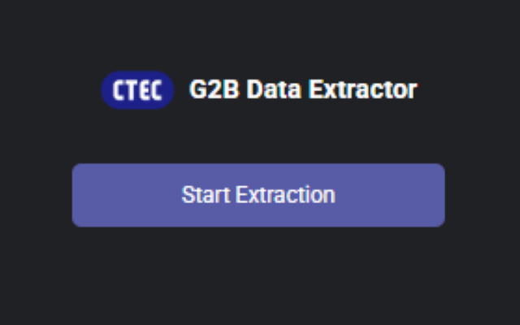
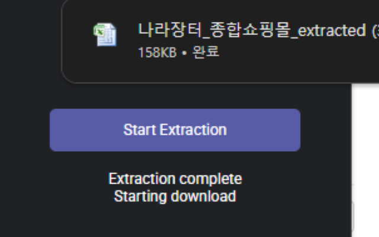
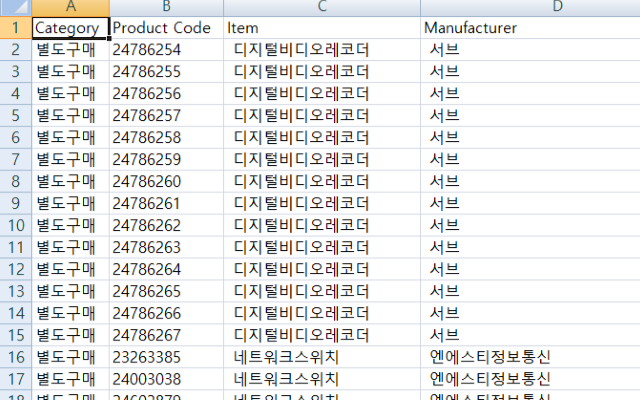

<div align="center">

  

  <h3>나라장터 종합쇼핑몰 상품 Data 자동 추출 Chrome Extension</h3>

  <p>
    
    
    
    
  </p>

</div>

---

## Overview

**G2B Data Extractor**는 [나라장터 종합쇼핑몰](https://shop.g2b.go.kr)의 상품 목록 페이지에서 Data를 자동으로 추출하여 Excel 파일로 저장하는 Chrome Extension입니다.

---

## Features

| Feature     | Description                                                |
| ----------- | ---------------------------------------------------------- |
| 자동 Data 추출  | 나라장터 상품 목록에서 Category, Product Code, Item, Manufacturer 추출 |
| Excel 저장    | 추출된 Data를 `.xlsx` 형식으로 즉시 Download                         |
| 단일 Click 동작 | Extension Popup에서 Button 한 번으로 전체 추출 완료                    |
| Page 자동 순회  | 목록 전체를 순차적으로 순회하여 전체 Data 수집                               |

---

## Demo

<table>
  <tr>
    <td align="center"><b>Extension Popup</b><br><sub>Start Extraction Button Click</sub></td>
    <td align="center"><b>추출 완료</b><br><sub>Excel file Download</sub></td>
  </tr>
  <tr>
    <td align="center"></td>
    <td align="center"></td>
  </tr>
</table>

<div align="center">
  <b>Output Excel</b><br><br>
  
</div>

---

## Getting Started

### Prerequisites

- Google Chrome Browser

### Installation

**방법 1 — Chrome Web Store (권장)**

[](https://chromewebstore.google.com/detail/g2b-data-extractor/pmpbpbjaipbhkegompfglgomakbinimn)

**방법 2 — 수동 설치 (개발자)**

1. 이 Repository Clone 또는 ZIP Download
```bash
git clone https://github.com/Hoporing/G2B_Data_Extractor.git
```

2. Chrome 브라우저에서 `chrome://extensions` 접속
3. 우측 상단 **개발자 모드** 활성화
4. **압축해제된 확장 프로그램을 로드합니다** → Download Folder 선택

### Usage

1. [나라장터 종합쇼핑몰](https://shop.g2b.go.kr) 접속 후 상품 목록 Page로 이동
2. Click Extension Icon of Chrome
3. Click **Start Extraction** Button
4. 추출 완료 후 Excel file 자동 Download

---

## Output Format

| Column       | Description    |
| ------------ | -------------- |
| Category     | 구매 방식 (별도구매 등) |
| Product Code | 물품식별번호         |
| Item         | 상품명            |
| Manufacturer | 제조사            |
| Model        | 모델명            |
| Option       | 옵션 (없는 경우 공백)  |
| Price        | 단가             |

---

## Tech Stack

| 항목 | 내용 |
|------|------|
| Platform | Chrome Extension (Manifest V3) |
| Language | JavaScript |
| Excel 생성 | [SheetJS](https://sheetjs.com/) (xlsx.full.min.js) |
| Target Site | 나라장터 종합쇼핑몰 (shop.g2b.go.kr) |

---

## License

Apache License 2.0
